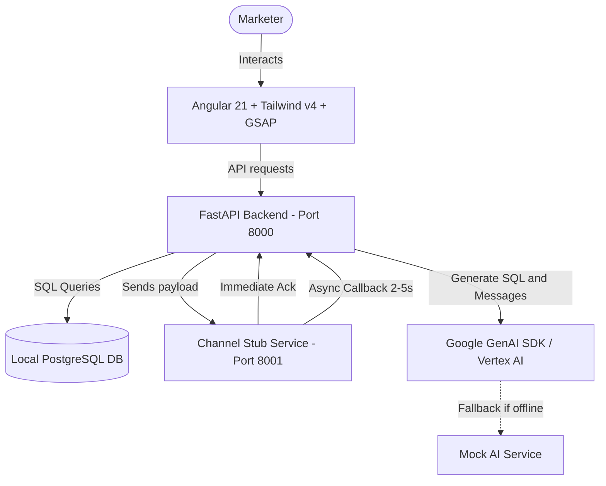

# AI-Native Mini CRM - Architecture and Design Decisions

This document summarizes the architectural and design decisions aligned with the user during the /grill-me session.

---

## High-Level Technical Architecture

---

## Design Tree Decisions

### 1. Database Layer
- **Decision:** Use a local PostgreSQL server (or local Docker container) for development and testing.
- **ORM and Migrations:** Implement tables using SQLAlchemy 2.0 ORM models and manage schema updates via Alembic migrations.

### 2. AI Engine Integration
- **Decision:** Use the Google GenAI SDK targeting Vertex AI models (such as Gemini).
- **Offline / Mock Fallback:** Build a robust mock/offline mode that generates realistic SQL queries and campaign templates if Google Cloud credentials are not present in the local .env environment.

### 3. Background Workers and Send Loop
- **Decision:** Utilize FastAPI's built-in BackgroundTasks and asyncio.create_task for lightweight, async local development. This avoids setting up separate Redis/Celery infrastructure while preserving the callback architecture.

### 4. Frontend Styling and Animations
- **Decision:** Customize the layout using Tailwind CSS (v4) and incorporate UI animations using GSAP (including ScrollTrigger and interactive animations).
- **Authentication Flow:** Include a custom, GSAP-animated landing/login page to introduce the platform before routing into the CRM dashboard.

### 5. Seeding Strategy
- **Decision:** Create a custom python seed script (seed_data.py) to generate realistic synthetic customer profiles, purchase history, seasonal purchase trends, and session/cart events.

### 6. Documentation Policy
- **Decision:** Maintain comprehensive documentation for both the frontend and backend. Every component, API router, service, and state store should have a clear, emoji-free markdown document describing its purpose, design choices, API, and state flows.
